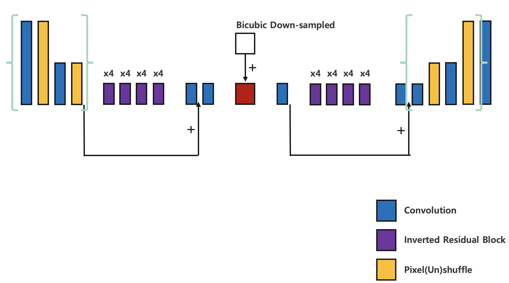

# Image Downscaling & Super-Resolution based on Once-for-All

This repository contains image downscaling & super-resolution project code based on the paper ["Once-for-All: Train One Network and Specialize it for Efficient Deployment"](https://arxiv.org/abs/1908.09791) (ICLR 2020).

The objectives of this proejct are
* Find the best image downscaling & super-resolution neural network architecture on mobile devices (Support both 2x, 4x super-resolution in a single architecture).
* Find the best video downscaling & super-resolution strategy to reduce data transmission.

## License and Citation

```BibTex
@inproceedings{
  cai2020once,
  title={Once for All: Train One Network and Specialize it for Efficient Deployment},
  author={Han Cai and Chuang Gan and Tianzhe Wang and Zhekai Zhang and Song Han},
  booktitle={International Conference on Learning Representations},
  year={2020},
  url={https://arxiv.org/pdf/1908.09791.pdf}
}
```

```BibTex
@inproceedings{
  kim2018tar,
  title={Task-Aware Image Downscaling},
  author={Heewon Kim and Myungsub Choi and Bee Lim and Kyoung Mu Lee},
  booktitle={European Conference on Computer Vision},
  year={2018},
  url={https://openaccess.thecvf.com/content_ECCV_2018/papers/Heewon_Kim_Task-Aware_Image_Downscaling_ECCV_2018_paper.pdf}
}
```

```BibTex
@inproceedings{
  yeo2018nas,
  title={Neural Adaptive Content-aware Internet Video Delivery},
  author={Hyunho Yeo and Youngmok Jung and Jaehong Kim and Jinwoo Shin and Dongsu Han},
  booktitle={USENIX Symposium on Operating Systems Design and Implementation},
  year={2018},
  url={https://www.usenix.org/system/files/osdi18-yeo.pdf}
}
```

# 2x/4x Image Downscaling & Super-Resolution in a Single Mobile Architecture

#### Overview of Supernet Architecture
  
#### Progressive Shrinking of
* Kernel Size
* Network Depth
* Expand Ratio
* Number of Pixelshuffle

### Comparison to CAR in terms of PSNR
["CAR: Learned Image Downscaling for Upscaling using Content Adaptive Resampler"](https://arxiv.org/abs/1907.12904)
</ul>
<table>
<thead>
<tr>
<th align="center">Dataset</th>
<th align="center">Ours</th>
<th align="center">CAR</th>
</tr>
</thead>
<tbody>
<tr>
<td align="center">Set14-2xUP</td>
<td align="center">39.15</td>
<td align="center">35.61</td>
</tr>
<tr>
<td align="center">Set14-4xUP</td>
<td align="center">31.01</td>
<td align="center">30.30</td>
</tr> 
</tbody></table>

#  Video Downscaling & Super-Resolution to Reduce Data Transmission

Please read ["Neural Adaptive Content-aware Internet Video Delivery"](https://www.usenix.org/system/files/osdi18-yeo.pdf) how it works.
